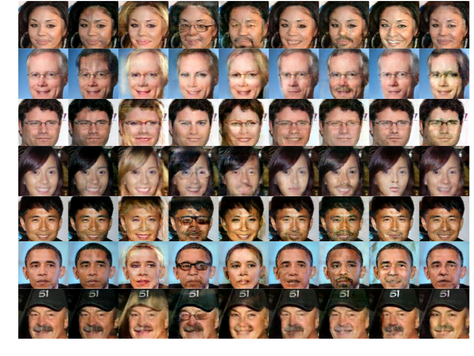

# ResidualGAN

Tensorflow implementation of [Learning Residual Images for Face Attribute Manipulation](https://arxiv.org/abs/1612.05363) <br>

## Prerequisites
* Python 3.6
* Tensorflow 1.6

## Results for Facial Attribute Transfer on CelebA
The images are generated by ResidualGAN trained on the CelebA dataset.

<p align="center"></p>

## Usage

#### 1. Clone the repository
```bash
$ git clone https://github.com/ioanachelu/ResidualGAN.git
$ cd ResidualGAN/
```

#### 2. Download the dataset into ```../data```. It should have the following substructure:
        .data
            celebA
            list_attr_celebs.txt

#### 3. Train ResidualGAN with CelebA
```bash
$ python train.py --train=True --logdir=./logdir --config=default --dataset_path=../data
```

#### 4. Resume ResidualGAN training with CelebA
```bash
$ python train.py --train=True --resume=True --load_from=./logdir/0-std_gan --config=std_gan --dataset_path=../data
```
